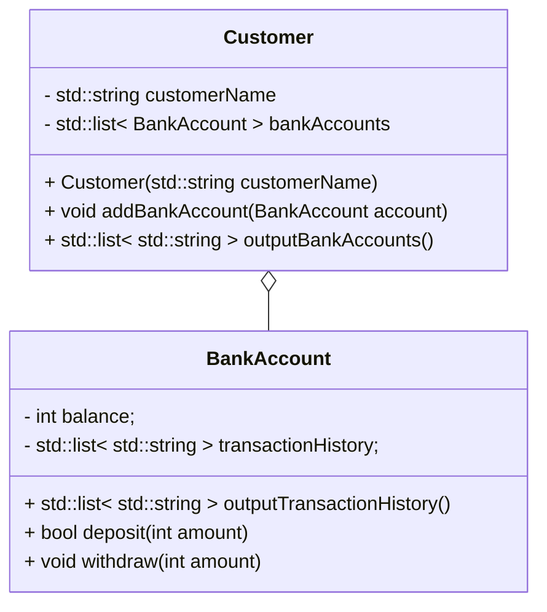
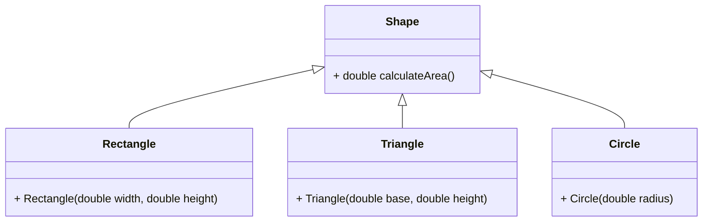
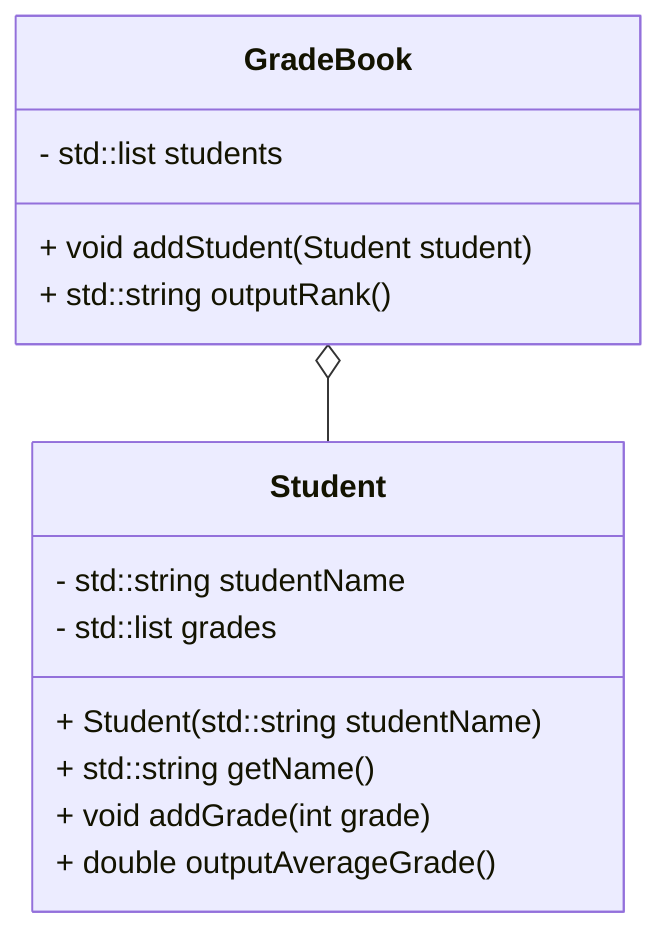
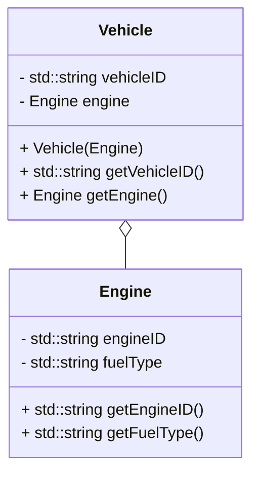
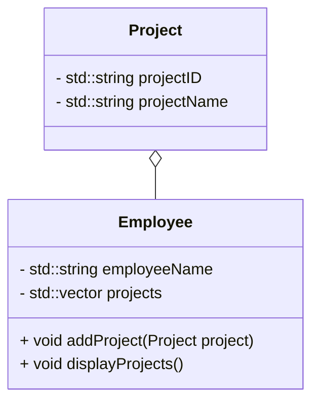
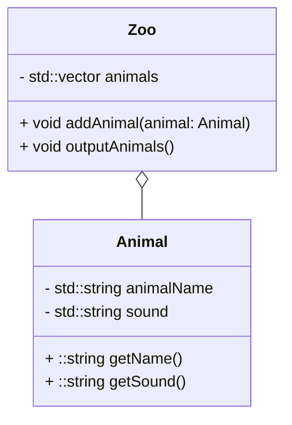
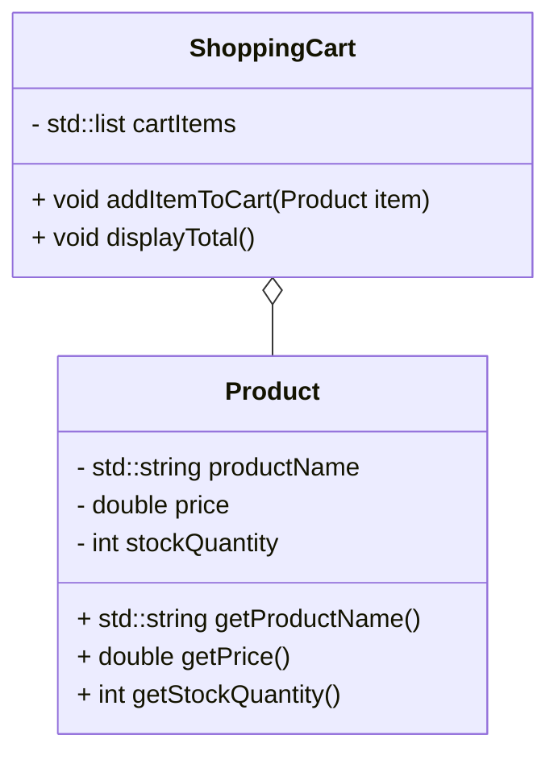
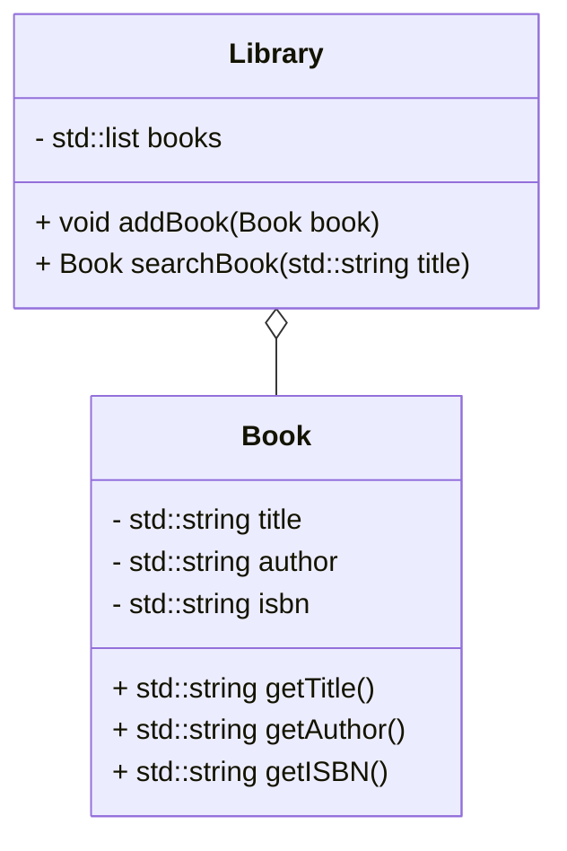
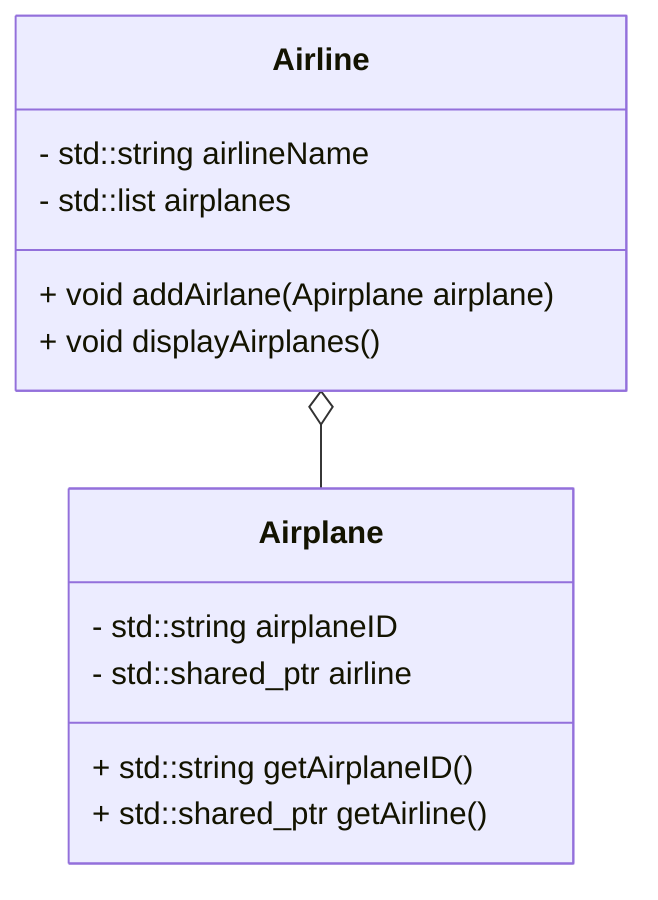
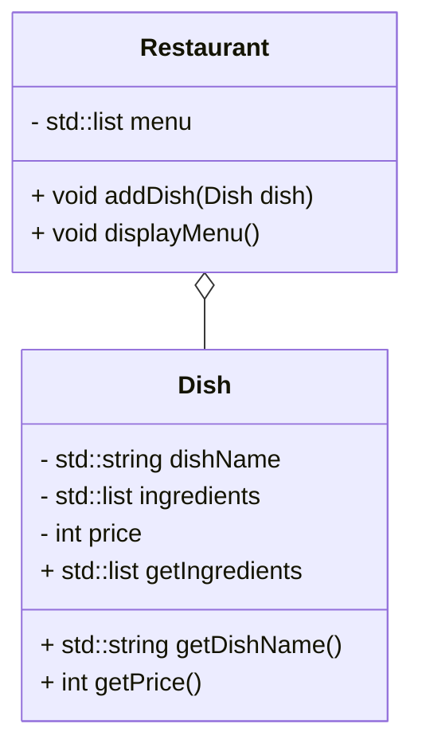

## Chapter. 3

下記、設問で提示されるメンバ変数とメソッドが実装されたクラスを作成してください。

ただし、テストコードは実装済みです。
テストコードが通るように作成して下さい。

### 3-1. 銀行口座と顧客
- `BankAccount`クラス:
    - 機能
        - 口座の残高を管理する.
        - 出金、入金の取引履歴を記録する.
        - 履歴は以下の形式とする.
            - 出金
                "__- 金額__"
            - 入金
                "__+ 金額__"
        - 履歴が出力できる.
    - メンバ変数: 
        * 口座残高 (`balance`)
        * 取引履歴 (`transactionHistory`)
    - メソッド:
        * 取引履歴の出力 (`outputTransactionHistory()`)
        * 入金 (`deposit()`)
        * 出金 (`withdraw()`)

- `Customer`クラス:
    - 機能
        - 口座を持つ顧客を管理する.
        - 複数の口座を所持可能.
        - 口座情報表示時は、所持する口座の取引履歴を出力する.
            - 表示は以下の順番とする。
                1. 顧客名
                1. 口座の取引履歴
                1. 口座の算高
    - メンバ変数
        * 顧客名 (`customerName`)
        * 銀行口座リスト (`bankAccounts`)
    - メソッド
        * 口座追加 (`addBankAccount()`)
        * 口座情報表示 (`outputBankAccounts()`)

### 3-2. 図形
- `Shape`クラス:
    - 図形クラスの基底クラス.
    - メソッド: 
        * 面積計算 (`calculateArea()`)

- `Rectangle`クラス:
    - 矩形を表すクラス.
    - 幅と高さを持つ.
    - メンバ変数: 
        * 幅(`width`)
        * 高さ(`height`)
- `Triangle`クラス:
    - 三角形を表すクラス.
    - 底辺と高さを持つ.
    - メンバ変数: 
        * 底辺(`base`)
        * 高さ(`height`)
- `Circle`クラス:
    - 円を表すクラス.
    - 半径を持つ.
    - メンバ変数: 
        * 半径(`radius`)

### 3-3. 学生と成績
- `Student`クラス:
    - 機能
        - 学生の成績を登録するクラス.
        - 5教科分の成績を登録できる.
        - 教科名は区別できなくてよい.
    - メンバ変数:
        * 学生名 (`studentName`)
        * 成績 (`grades`)
    - メソッド:
        * 成績追加 (`addGrade()`)
        * 成績の平均値を出力 (`outputAverageGrade()`)

- `GradeBook`クラス:
    - 機能
        - 成績を登録した学生を管理するクラス.
        - 順位は平均値の高い順に学生名を出力する.
        以下に出力形式を示す.
        得点は小数点第1位までの表示とする.
            - "順位,名前,得点"
    - メンバ変数:
        * 学生リスト (`students`)
    - メソッド:
        * 学生追加 (`addStudent()`)
        * 順位出力 (`outputRank()`)

### 3-4. 車両とエンジン
- `Engine`クラス:
    - 機能
        - エンジンには燃料種別がある.
    - メンバ変数:
        * エンジン (`engineID`)
        * 燃料種別 (`fuelType`)
    - メソッド:
        * エンジン名取得 (`getEngineID()`)
        * 燃料種別取得 (`getFuelType()`)
- `Vehicle`クラス:
    - 機能
        - 車両はエンジンを搭載できる.
    - メンバ変数:
        * 車両名 (`vehicleID`)
        * エンジン (`engine`)
    - メソッド:
        *  エンジン取得(`getEngine()`)
        *  車両名取得(`getVehicleID()`)

### 3-5. 従業員とプロジェクト
- `Project`クラス:
    - 機能
        - プロジェクトクラスは名称とIDを持つ.
    - メンバ変数:
        * ID (`projectID`)
        * 名称 (`projectName`)
    - メソッド:
        * プロジェクトID取得 (`getProjectID()`)
        * プロジェクト名取得 (`getProjectName()`)
- `Employee`クラス:
    - 機能
        - 従業員は複数のプロジェクトに参加できる.
    - メンバ変数:
        * 従業員名 (`employeeName`)
        * プロジェクトリスト (`projectLists`)
    - メソッド:
        *  プロジェクト追加(`addProject()`)
        *  参加プロジェクト取得(`getProject()`)

### 3-6. 動物と動物園

- `Animal`クラス:
    - 機能
        - 動物クラスは名称と鳴き声を持つ.
    - メンバ変数:
        * 名称 (`animalName`)
        * 鳴き声 (`sound`)
    - メソッド:
        * 動物名取得 (`getAnimalName()`)
        * 鳴き声取得 (`getSound()`)
- `Zoo`クラス:
    - 機能
        - 動物園には複数の動物が存在する.
    - メンバ変数:
        * 動物リスト (`animals`)
    - メソッド:
        * 動物追加 (`addAnimal(Animal animal)`)
        * 動物一覧出力 (`outputAnimals()`)

### 3-7. 商品とショッピングカート

- `Product`クラス:
    - 機能
        - 商品クラスは商品名、価格、在庫数量を持つ.
    - メンバ変数:
        * 商品名 (`productName`)
        * 価格 (`price`)
        * 在庫数量 (`stockQuantity`)
    - メソッド:
        * 商品名取得 (`getProductName()`)
        * 価格取得 (`getPrice()`)
        * 在庫数量取得 (`getStockQuantity()`)
- `ShoppingCart`クラス:
    - 機能
        - ショッピングカートには商品が複数入る.
        - ショッピングカートは合計金額を表示できる.
    - メンバ変数:
        * カートアイテムリスト (`cartItems`)
    - メソッド:
        * 商品追加 (`addItemToCart(Product item)`)
        * 合計金額表示 (`displayTotal()`)

### 3-8. 本と図書館

- `Book`クラス:
    - 機能
        - 図書クラスはタイトル、著者、ISBNを持つ.
    - メンバ変数:
        * タイトル (`title`)
        * 著者 (`author`)
        * ISBN (`isbn`)
    - メソッド:
        * タイトル取得 (`getTitle()`)
        * 著者取得 (`getAuthor()`)
        * ISBN取得 (`getISBN()`)
- `Library`クラス:
    - 機能
        - 図書館には複数の図書が存在する.
    - メンバ変数:
        * 図書リスト (`books`)
    - メソッド:
        * 図書追加 (`addBook(Book book)`)
        * 図書検索 (`searchBook(std::string title)`)

### 3-9. 飛行機と航空会社

- `Airplane`クラス:
    - 機能
        - 飛行機クラスは航空会社に所属する.
    - メンバ変数:
        * 飛行機ID (`airplaneID`)
        * 所属航空会社 (`airline`)
    - メソッド:
        * 飛行機ID取得 (`getAirplaneID()`)
        * 航空会社取得 (`getAirline()`)
- `Airline`クラス:
    - 機能
        - 航空会社は複数の飛行機を所有する.
    - メンバ変数:
        * 航空会社名 (`airlineName`)
        * 所有飛行機リスト (`airplanes`)
    - メソッド:
        * 飛行機追加 (`addAirlane(Apirplane airplane)`)
        * 所有飛行機表示 (`displayAirplanes()`)

### 3-10. 料理とレストラン

- `Dish`クラス:
    - 機能
        - 料理クラスは名称、材料、価格を持つ.
    - メンバ変数:
        * 料理名 (`dishName`)
        * 材料リスト (`ingredients`)
        * 価格 (`price`)
    - メソッド:
        * 料理名取得 (`getDishName()`)
        * 材料取得 (`getIngredients()`)
        * 価格取得 (`getPrice()`)
- `Restaurant`クラス:
    - 機能
        - レストランには複数の料理が存在する.
    - メンバ変数:
        * メニューリスト (`menu`)
    - メソッド:
        * 料理追加 (`addDish(Dish dish)`)
        * メニュー表示 (`displayMenu()`)

