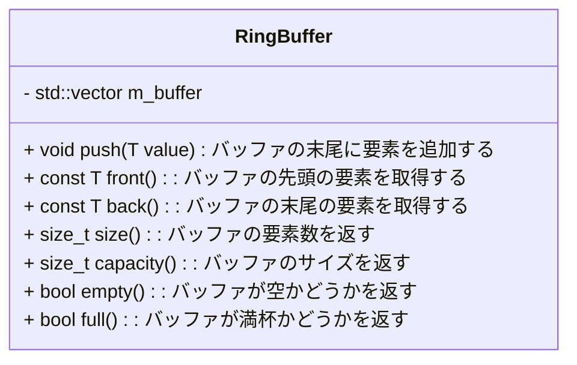
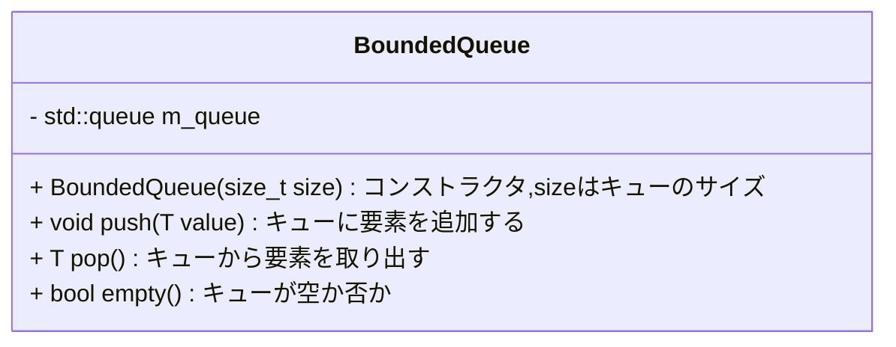

## Chapter. 5

### 5-1. リングバッファ

リングバッファ（別名：サーキュラーバッファ）を実装してください。
リングバッファは、指定されたサイズの配列で構成され、要素の挿入と参照ができます。
バッファする型はテンプレートで定義してください。



<details>
<summary>回答例</summary>

```
#include <vector>

template <typename T>
class RingBuffer
{
public:
    RingBuffer(size_t size) : m_buffer(size), m_size(0), m_front(0), m_back(0) {}

    void push(T value)
    {
        if (m_size == m_buffer.size()) {
            m_front = (m_front + 1) % m_buffer.size();
        }
        m_buffer[m_back] = value;
        m_back = (m_back + 1) % m_buffer.size();
        m_size = std::min(m_size + 1, m_buffer.size());
    }

    T front() const { return m_buffer[m_front]; }
    T back() const { return m_buffer[(m_back + m_buffer.size() - 1) % m_buffer.size()]; }
    size_t size() const { return m_size; }
    size_t capacity() const { return m_buffer.size(); }
    bool empty() const { return m_size == 0; }
    bool full() const { return m_size == m_buffer.size(); }

private:
    std::vector<T> m_buffer;
    size_t m_size;
    size_t m_front;
    size_t m_back;
};
```

</details>


### 5-2. 移動平均フィルタ

5-1で作成したリングバッファを拡張して移動平均(MovingAverage)フィルタクラスを作成します。

このクラスは指定されたサイズのリングバッファを持ちます。
バッファはint型の数値を格納します。

リングバッファの実装は、以下のメンバ関数を持つこと
- addValue() : バッファの末尾に要素を追加する
- getAverage() : バッファの要素の平均を返す

<details>
<summary>回答例</summary>

```

class MovingAverage
{
public:
    MovingAverage(size_t size) : m_buffer(size), m_sum(0) {}

    void addValue(int value)
    {
        m_sum += value;
        if (m_buffer.full()) {
            m_sum -= m_buffer.front();
        }
        m_buffer.push(value);
    }

    double getAverage() const { return m_sum / static_cast<double>(m_buffer.size()); }

private:
    RingBuffer<int> m_buffer;
    int m_sum;
};
```
</details>


### 5-3. スレッドセーフなキュー

スレッドセーフなキューを作成してください。
キーワード：
* std::mutex
* std::condition_variable




<details>
<summary>回答例</summary>

```
#include <mutex>
#include <condition_variable>
#include <queue>
template <typename T>
class BoundedQueue
{
public:
    BoundedQueue(size_t size) : m_size(size) {}

    void push(T value)
    {
        std::unique_lock<std::mutex> lock(m_mutex);
        m_condition_push.wait(lock, [this]() { return m_queue.size() < m_size; });
        m_queue.push(value);
        m_condition_pop.notify_one();
    }

    T pop()
    {
        std::unique_lock<std::mutex> lock(m_mutex);
        m_condition_pop.wait(lock, [this]() { return !m_queue.empty(); });
        T value = m_queue.front();
        m_queue.pop();
        m_condition_push.notify_one();
        return value;
    }
    
    bool empty()
    {
        std::unique_lock<std::mutex> lock(m_mutex);
        return m_queue.empty();
    }

private:
    size_t m_size;
    std::queue<T> m_queue;
    std::mutex m_mutex;
    std::condition_variable m_condition_push;
    std::condition_variable m_condition_pop;
};
```
</details>
