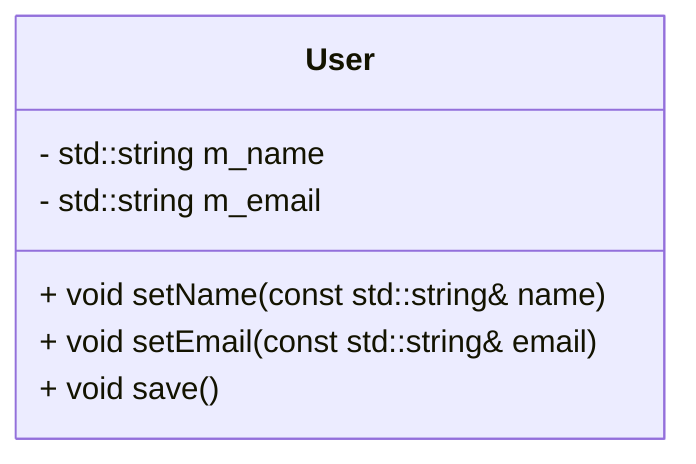
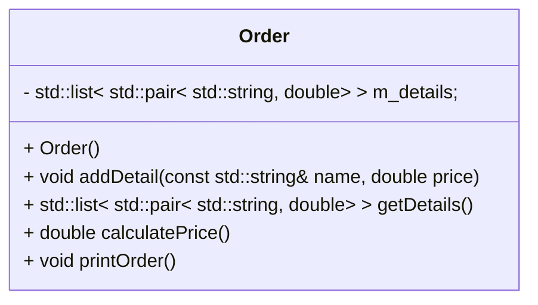

## Chapter. 6

SOLID原則に違反する例題を、違反しないように実装してください。
また、違反しないケースにおけるテストコードも記述してください。
* S : 単一責任原則（Single Responsibility Principle, SRP）
* O : オープン・クローズド原則（Open-Closed Principle, OCP）
* L : リスコフの置換原則（Liskov Substitution Principle, LSP）
* I : インターフェース分離原則（Interface Segregation Principle, ISP）
* D : 依存関係逆転の原則（Dependency Inversion Principle, DIP）


### 6-1. 単一責任原則 その1

以下の User クラスは、ユーザー情報の管理とユーザー情報の保存の2つの責任を持っています.
このクラスを2つのクラスに分割して、各クラスが一つの責任だけを持つようにしてください.



<details>
<summary>回答例</summary>

```
#include <iostream>
#include <string>

class User
{
public:
    User(const std::string& name, const std::string& email)
        : name_(name), email_(email)
    {
    }

    std::string name() const
    {
        return name_;
    }

    std::string email() const
    {
        return email_;
    }

private:
    std::string name_;
    std::string email_;
};

class UserDatabase
{
public:
    void save(const User& user)
    {
        // ユーザー情報を保存する処理
    }
};
```

</details>


### 6-2. 単一責任原則 その2
Order クラスは、注文の詳細を管理し、注文の価格を計算し、注文を印刷する責任を持っています.
このクラスを3つのクラスに分割して、各クラスが一つの責任だけを持つようにしてください.



<details>
<summary>回答例</summary>

```
#include <iostream>
#include <list>
#include <string>
class Order
{
public:
    void addDetail(const std::string& name, double price)
    {
        m_details.push_back(std::make_pair(name, price));
    }

    std::list< std::pair< std::string, double> > getDetails() const
    {
        return m_details;
    }

private:
    std::list< std::pair< std::string, double> > m_details;
};

class OrderCalculator
{
public:
    double calculatePrice(const Order& order)
    {
        double total = 0.0;
        auto details = order.getDetails();
        for (const auto& detail : details)
        {
            total += detail.second;
        }
        return total;
    }
};

class OrderPrinter
{
public:
    void printOrder(const Order& order)
    {
        auto details = order.getDetails();
        for (const auto& detail : details)
        {
            std::cout << detail.first << ": " << detail.second << std::endl;
        }
    }
};
```

</details>


### 6-3. オープン・クローズド原則 その1

以下の Shape クラスは、新しい形状を追加するたびに draw メソッドを変更する必要があります.
このクラスを改善して、新しい形状を追加しても draw メソッドを変更しなくても良いようにしてください.

```c
class Shape {
public:
    enum ShapeType {circle, square};
    ShapeType type;
};

void draw(Shape& s) {
    if (s.type == Shape::circle) {
        drawCircle();
    } else if (s.type == Shape::square) {
        drawSquare();
    }
}
```

<details>
<summary>回答例</summary>

```

#include <iostream>

class Shape {
public:
    enum ShapeType {circle, square};
    ShapeType type;
    virtual void draw() = 0;
};

class Circle : public Shape {
public:
    void draw() override {
        std::cout << "Drawing a circle" << std::endl;
    }
};

class Square : public Shape {
public:
    void draw() override {
        std::cout << "Drawing a square" << std::endl;
    }
};

void draw(Shape& s) {
    s.draw();
}
```

</details>


### 6-4. オープン・クローズド原則 その2

Discount クラスは、さまざまな種類の割引を計算する責任を持っています。新しい種類の割引を追加するたびに、このクラスを変更する必要があります。このクラスを改善して、新しい種類の割引を追加しても Discount クラスを変更しなくても良いようにしてください。

```c
class Discount {
public:
    double calculate(double price, const std::string& discountType) {
        if (discountType == "Student") {
            return price * 0.8;
        } else if (discountType == "Senior") {
            return price * 0.85;
        } else {
            return price;
        }
    }
};
```

<details>
<summary>回答例</summary>

```
class Discount {
public:
    virtual double calculate(double price) = 0;
};

class StudentDiscount : public Discount {
public:
    double calculate(double price) override {
        return price * 0.8;
    }
};

class SeniorDiscount : public Discount {
public:
    double calculate(double price) override {
        return price * 0.85;
    }
};
```

</details>


### 6-5. リスコフの置換原則 その1

Bird クラスから派生した Penguin クラスは、fly メソッドを持っていますが、ペンギンは飛べません.
この問題を解決するために、クラスの設計をどのように改善しますか？


```c
#include <iostream>
#include <stdexcept>
class Bird {
public:
    virtual void fly() {
        // 飛ぶロジック
    }
};

class Penguin : public Bird {
public:
    void fly() override {
        throw std::logic_error("Penguins can't fly!");
    }
};
```

<details>
<summary>回答例</summary>

```
class Bird {
public:
    // 共通のメソッド
};

class FlyingBird : public Bird {
public:
    void fly() {
        // 飛ぶロジック
    }
};

class Penguin : public Bird {
    // Penguin特有のメソッド
};
```

</details>

### 6-6. リスコフの置換原則 その2

Rectangle クラスから派生した Square クラスは、幅と高さが常に等しくなければならないという制約があります.
しかし、Rectangle クラスの setWidth と setHeight メソッドは、幅と高さを個別に設定できます.
この問題を解決するために、クラスの設計をどのように改善しますか？

```c
class Rectangle {
public:
    virtual void setWidth(int width) {
        this->m_width = width;
    }
    virtual void setHeight(int height) {
        this->m_height = height;
    }
protected:
    int m_width;
    int m_height;
};

class Square : public Rectangle {
public:
    void setWidth(int width) override {
        this->m_width = this->m_height = width;
    }
    void setHeight(int height) override {
        this->m_width = this->m_height = height;
    }
};
```

<details>
<summary>回答例</summary>

```
class Shape {
public:
    virtual int area() = 0;
};

class Rectangle : public Shape {
public:
    void setWidth(int width) {
        this->m_width = width;
    }
    void setHeight(int height) {
        this->m_height = height;
    }
    int area() override {
        return m_width * m_height;
    }
protected:
    int m_width;
    int m_height;
};

class Square : public Shape {
public:
    void setSize(int size) {
        this->m_size = size;
    }
    int area() override {
        return m_size * m_size;
    }
protected:
    int m_size;
};
```

</details>


### 6-7. インターフェース分離原則 その1

Machine インターフェースは、print、scan、fax の3つのメソッドを持っています.
しかし、SimplePrinter クラスは print メソッドしか必要としません.
この問題を解決するために、インターフェースの設計をどのように改善しますか？

```c
class Machine {
public:
    virtual void print() = 0;
    virtual void scan() = 0;
    virtual void fax() = 0;
};

class SimplePrinter : public Machine {
public:
    void print() override {
        // print logic
    }
    void scan() override {
        throw std::logic_error("Not supported!");
    }
    void fax() override {
        throw std::logic_error("Not supported!");
    }
};
```

<details>
<summary>回答例</summary>

```
class Printer {
public:
    virtual void print() = 0;
};

class Scanner {
public:
    virtual void scan() = 0;
};

class Fax {
public:
    virtual void fax() = 0;
};

class SimplePrinter : public Printer {
public:
    void print() override {
        // print logic
    }
};
```

</details>


### 6-8. インターフェース分離原則 その2

Workerインターフェースは、workとeatの2つのメソッドを持っています.
しかし、Robotクラスはeatメソッドを必要としません.
この問題を解決するために、インターフェースの設計をどのように改善しますか？

```c
class Worker {
public:
    virtual void work() = 0;
    virtual void eat() = 0;
};

class Robot : public Worker {
public:
    void work() override {
        // work logic
    }
    void eat() override {
        throw std::logic_error("Not supported!");
    }
};
```

<details>
<summary>回答例</summary>

```
class Workable {
public:
    virtual void work() = 0;
};

class Eatable {
public:
    virtual void eat() = 0;
};

class Robot : public Workable {
public:
    void work() override {
        // work logic
    }
};
```

</details>


### 6-9. 依存関係逆転の原則 その1

HighLevelModuleクラスが低レベルのLowLevelModuleクラスに直接依存しています.
HighLevelModuleクラスが実体に直接依存しないようにしてください.

```c
class LowLevelModule {
public:
    void doSomething() {
        // do something
    }
};

class HighLevelModule {
public:
    void doSomething() {
        LowLevelModule lowLevelModule;
        lowLevelModule.doSomething();
    }
};
```

<details>
<summary>回答例</summary>

```
class Module {
public:
    virtual void doSomething() = 0;
};

class LowLevelModule : public Module {
public:
    void doSomething() override {
        // do something
    }
};

class HighLevelModule {
public:
    HighLevelModule(Module* module) : module(module) {}
    void doSomething() {
        module->doSomething();
    }
private:
    Module* module;
};
```

</details>


### 6-10. 依存関係逆転の原則 その2

Applicationクラスが具体的なMySQLDatabaseクラスに直接依存しています.
Applicationクラスが実体に直接依存しないようにしてください.


```c
class MySQLDatabase {
public:
    void query(const std::string& sql) {
        // query logic
    }
};

class Application {
public:
    void doQuery() {
        MySQLDatabase database;
        database.query("SELECT * FROM users");
    }
};
```

<details>
<summary>回答例</summary>

```
class Database {
public:
    virtual void query(const std::string& sql) = 0;
};

class MySQLDatabase : public Database {
public:
    void query(const std::string& sql) override {
        // query logic
    }
};

class Application {
public:
    Application(Database* database) : database(database) {}
    void doQuery() {
        database->query("SELECT * FROM users");
    }
private:
    Database* database;
};
```

</details>

